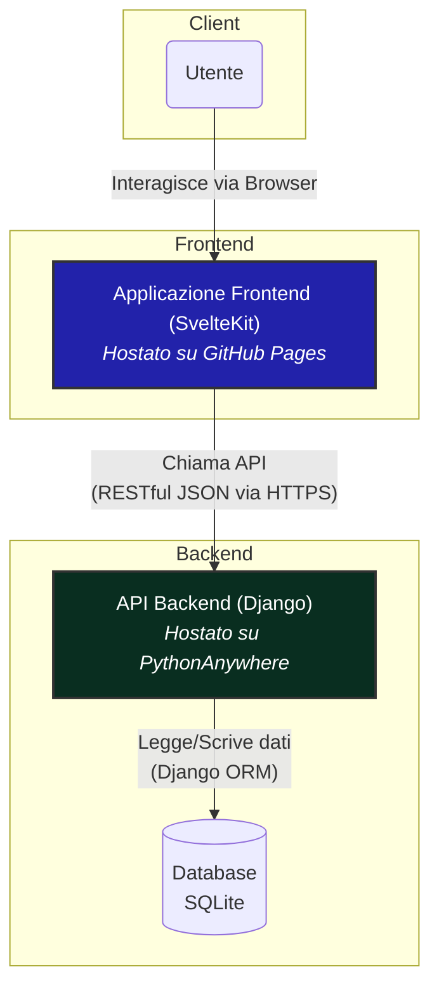
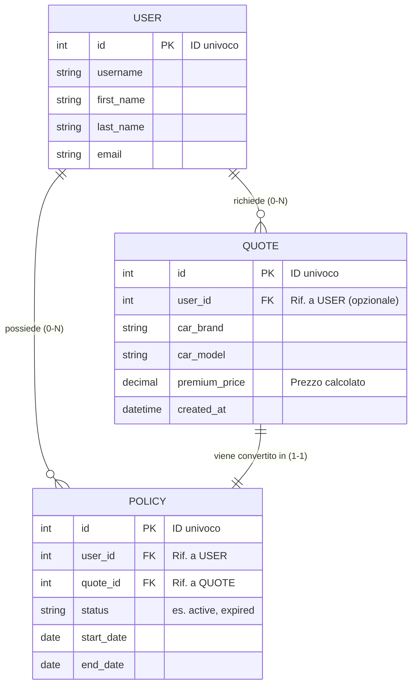
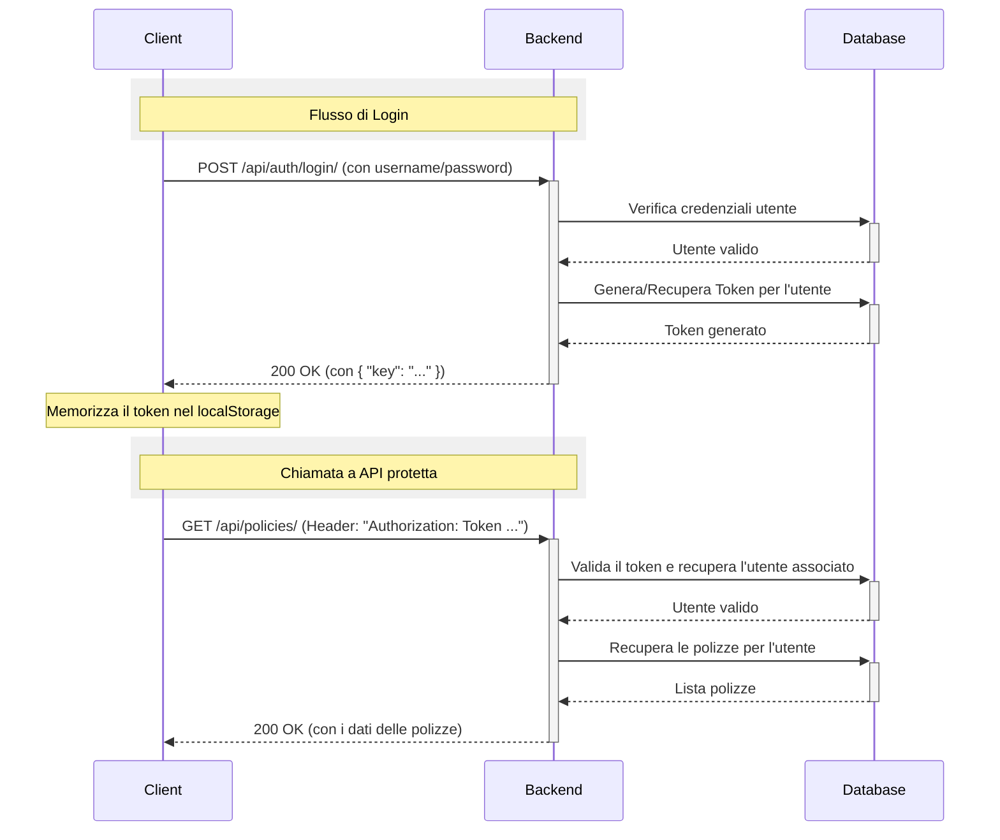

# Mermaid charts

## Panoramica Architetturale

```mermaid
graph TD
    subgraph "Client"
        A(Utente)
    end

    subgraph "Frontend"
        B["Applicazione Frontend (SvelteKit)<br><i>Hostato su GitHub Pages</i>"]
    end

    subgraph "Backend"
        C["API Backend (Django)<br><i>Hostato su PythonAnywhere</i>"]
        D[(Database<br>SQLite)]
    end

    A -- "Interagisce via Browser" --> B
    B -- "Chiama API<br>(RESTful JSON via HTTPS)" --> C
    C -- "Legge/Scrive dati<br>(Django ORM)" --> D

    style B fill:#22a,stroke:#333,stroke-width:2px,color:#fff
    style C fill:#092e20,stroke:#333,stroke-width:2px,color:#fff
```

## Entity-Relationship Diagram

```mermaid
erDiagram
    USER {
        int id PK "ID univoco"
        string username
        string first_name
        string last_name
        string email
    }

    QUOTE {
        int id PK "ID univoco"
        int user_id FK "Rif. a USER (opzionale)"
        string car_brand
        string car_model
        decimal premium_price "Prezzo calcolato"
        datetime created_at
    }

    POLICY {
        int id PK "ID univoco"
        int user_id FK "Rif. a USER"
        int quote_id FK "Rif. a QUOTE"
        string status "es. active, expired"
        date start_date
        date end_date
    }

    USER ||--o{ QUOTE : "richiede (0-N)"
    USER ||--o{ POLICY : "possiede (0-N)"
    QUOTE ||--|| POLICY : "viene convertito in (1-1)"
```

## Sequence Diagram - Auth

```mermaid
sequenceDiagram
    participant Client
    participant Backend
    participant Database

    rect rgb(240, 240, 240)
        Note over Client, Backend: Flusso di Login
    end
    Client->>+Backend: POST /api/auth/login/ (con username/password)
    Backend->>+Database: Verifica credenziali utente
    Database-->>-Backend: Utente valido
    
    Backend->>+Database: Genera/Recupera Token per l'utente
    Database-->>-Backend: Token generato
    
    Backend-->>-Client: 200 OK (con { "key": "..." })
    Note over Client: Memorizza il token nel localStorage

    rect rgb(240, 240, 240)
        Note over Client, Backend: Chiamata a API protetta
    end
    Client->>+Backend: GET /api/policies/ (Header: "Authorization: Token ...")
    Backend->>+Database: Valida il token e recupera l'utente associato
    Database-->>-Backend: Utente valido
    
    Backend->>+Database: Recupera le polizze per l'utente
    Database-->>-Backend: Lista polizze
    
    Backend-->>-Client: 200 OK (con i dati delle polizze)
```
